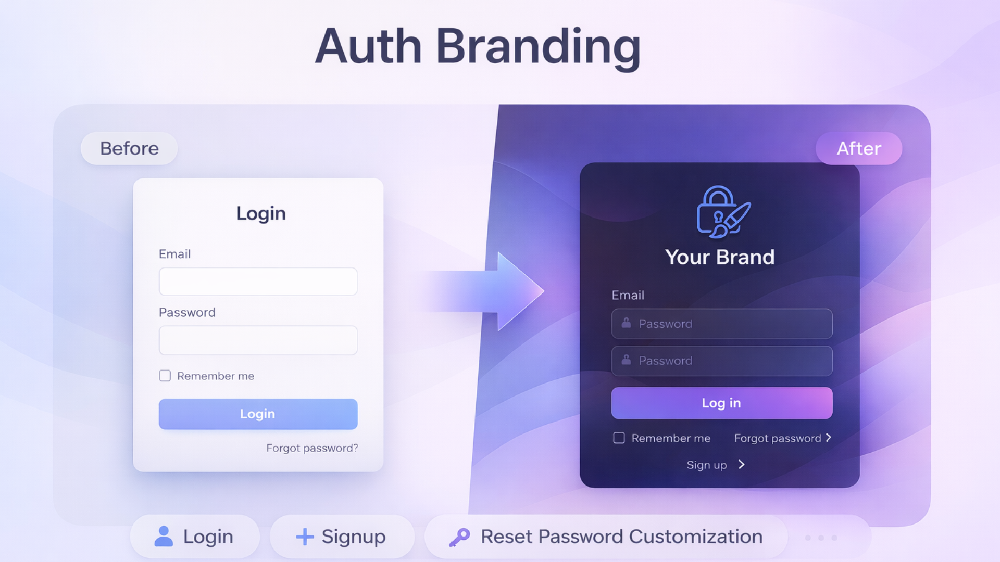
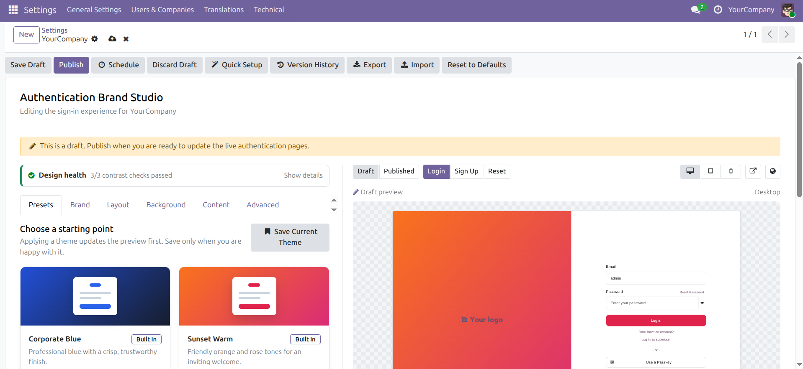
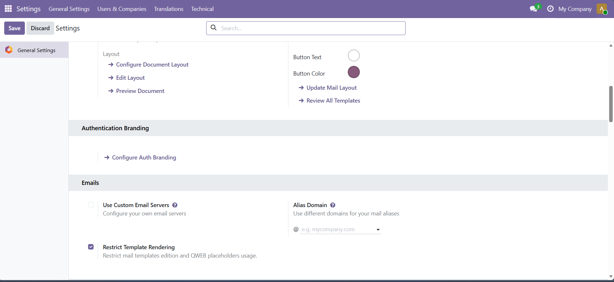
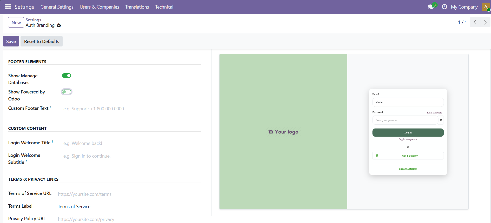
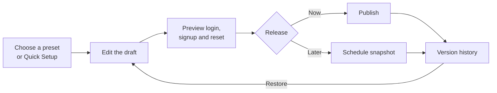

<p align="center">
  
</p>

<h1 align="center">Auth Branding for Odoo 19</h1>

<p align="center">
  <strong>Turn every sign-in into a polished, trusted brand experience.</strong><br />
  Design, preview, govern, and publish Odoo authentication pages—without editing templates.
</p>

<p align="center">
  <a href="https://www.odoo.com/documentation/19.0/"></a>
  
  <a href="LICENSE"></a>
  
</p>

<p align="center">
  <a href="#-why-auth-branding">Why Auth Branding</a> ·
  <a href="#-product-tour">Product Tour</a> ·
  <a href="#-features">Features</a> ·
  <a href="#-installation">Installation</a> ·
  <a href="#-configuration">Configuration</a> ·
  <a href="#-security-and-governance">Security</a>
</p>

---

## ✨ Why Auth Branding?

The login page is often the first—and most frequently repeated—touchpoint between users and an Odoo environment. Auth Branding replaces the generic experience with an interface that feels intentional, recognizable, and consistent with the rest of your business.

| For your users | For your brand team | For administrators |
| --- | --- | --- |
| A familiar, responsive sign-in experience | Visual editing with reusable themes | Drafts stay isolated from production |
| Consistent login, signup, and reset pages | Logo-aware color suggestions | Publish now, schedule, or roll back |
| Accessible colors and visible focus states | No QWeb or CSS knowledge required | Company isolation and audit history |

> **Built for real operations:** experiment safely in a draft, compare it with the published experience, validate desktop/tablet/mobile layouts, and release only when it is ready.

## 🖥️ Product tour

### A visual studio with the result beside you

Edit identity, layout, colors, backgrounds, content, and advanced presentation settings while the authentication page updates in the responsive preview.

<p align="center">
  
</p>

<p align="center"><em>Build the page on the left and inspect the user experience on the right.</em></p>

<table>
  <tr>
    <td width="50%">
      
      <p align="center"><strong>Native Odoo entry point</strong><br />Open Brand Studio directly from Settings.</p>
    </td>
    <td width="50%">
      
      <p align="center"><strong>Content and policy controls</strong><br />Keep every authentication screen consistent.</p>
    </td>
  </tr>
</table>

## 🚀 From idea to production



The public authentication pages read only from the active published version. A draft can be changed, imported, reset, or discarded without altering what users currently see.

## 🎨 Features

### Brand Studio

- Five responsive layouts: **Centered**, **Split Screen**, **Full Bleed**, **Minimal**, and **Sidebar**.
- Sticky preview with **desktop, tablet, and mobile** viewport controls.
- Instant switching between **Login, Sign Up, and Reset Password** pages.
- **Draft versus Published** comparison from the same preview toolbar.
- Compact Brand, Layout, Background, Content, and Advanced tabs.
- Per-section reset controls—restore one area without losing work elsewhere.
- Direct links to the preview and the real authentication page.

### Identity and visual design

- Company logo, favicon, tagline, page titles, and welcome messages.
- Primary, secondary, text, card, background, and button color controls.
- Solid, gradient, animated-gradient, and image backgrounds.
- Split alignment, glassmorphism, blur, opacity, and border-radius controls.
- Curated typography choices with system-font fallback.
- Light, dark, or device-controlled appearance.
- Coherent dark surfaces across every layout, including Split and Sidebar.

### Presets and guided setup

Start from eight professionally configured themes:

`Corporate Blue` · `Sunset Warm` · `Ocean Breeze` · `Dark Elegance` · `Minimal White` · `Nature Green` · `Berry Purple` · `Slate Modern`

- Three-step **Quick Setup** for identity, style, and review.
- Automatic primary and secondary color suggestions from an uploaded logo.
- Save the current visual design as a reusable company theme.
- Built-in themes are protected; custom themes remain manageable.

### Content and authentication details

- Independent titles and welcome copy for login, signup, and password reset.
- Custom footer messaging, Terms of Service, and Privacy Policy links.
- Configurable powered-by text and destination.
- Styled social/OAuth provider buttons with rounded, pill, square, or icon-focused variants.
- Optional database-manager link and social-label visibility.
- Branded spinner, progress-bar, or logo-pulse loading experience.

### Accessibility and responsive UX

- Live WCAG contrast checks for body text, links, and button labels.
- **One-click contrast fixes** with immediate preview feedback.
- Clear keyboard focus indicators.
- Reduced-motion support for users who request it.
- Responsive layouts and right-to-left presentation support.
- Accessible dark-mode links, inputs, placeholders, autofill, and password controls.

### Release management

- Explicit **Save Draft**, **Publish**, and **Discard Draft** actions.
- Immutable published versions with author and timestamp history.
- Restore an older version and republish it without destroying the audit trail.
- Schedule the current draft snapshot for a future release.
- Cancel pending schedules and inspect published, cancelled, or failed jobs.
- Scheduled settings and image assets cannot drift when later drafts are edited.

### Portability and advanced customization

- Export settings and embedded assets as a versioned JSON brand package.
- Review source, settings, assets, and ignored future fields before importing.
- Imports always become drafts and never publish automatically.
- Sanitized custom CSS for experienced administrators.
- Cache-aware theme and image delivery with ETag and security headers.

## 📦 Installation

### Option 1: Clone the repository

```bash
cd /path/to/custom-addons
git clone https://github.com/Trishan0/auth-branding.git
```

The repository contains the installable module at `auth-branding/auth_branding`. Add the repository directory to `addons_path`, then restart Odoo:

```ini
addons_path = /path/to/odoo/addons,/path/to/custom-addons/auth-branding
```

### Option 2: Copy the module

Copy the inner `auth_branding/` directory into an existing custom add-ons directory.

### Install in Odoo

1. Restart the Odoo service.
2. Enable developer mode.
3. Open **Apps → Update Apps List**.
4. Remove the default Apps filter if necessary.
5. Search for **Auth Branding** and select **Install**.

### Upgrade an existing installation

```bash
./odoo-bin -d your_database -u auth_branding --stop-after-init
```

Restart Odoo after the upgrade and refresh browser assets.

## ⚙️ Configuration

1. Open **Settings → General Settings → Authentication Branding**.
2. Select **Quick Setup** for a guided start or **Open Brand Studio** for full control.
3. Apply a preset or upload the company identity assets.
4. Refine the design in the focused editor tabs.
5. Check Login, Sign Up, and Reset Password at all three preview sizes.
6. Resolve any warnings in **Design health**.
7. Compare **Draft** with **Published**.
8. Publish immediately or capture the draft with **Schedule**.

> **Multi-company tip:** switch to the company you want to brand before opening Brand Studio. Each company receives its own configuration, presets, schedules, and published history.

## 🛡️ Security and governance

| Control | Behavior |
| --- | --- |
| Production isolation | Public pages render the active published snapshot—not the working draft. |
| Permissions | System administrators inherit the dedicated **Authentication Branding Manager** group. |
| Multi-company | Record rules and company-consistency checks isolate configurations, presets, versions, and schedules. |
| Scheduled releases | Settings and binary assets are captured as an immutable snapshot. |
| External links | Terms, privacy, and powered-by destinations accept HTTP/HTTPS URLs only. |
| Custom CSS | HTML, scripts, imports, external resources, data URLs, executable CSS, and oversized payloads are rejected. |
| Public assets | Allowlisted fields, conditional caching, content-type protection, and same-origin controls reduce exposure. |

Custom CSS is intended for local selectors and declarations. Always inspect it in Draft mode before publishing.

## 🔧 Technical overview

| Item | Details |
| --- | --- |
| Odoo version | 19.0 |
| Module version | 19.0.3.0.0 |
| Dependencies | `web`, `auth_signup`, `base_setup` |
| License | LGPL-3 |
| Backend | Odoo ORM models, HTTP controllers, record rules, transient wizards, scheduled action |
| Frontend | Owl components, Odoo registries/services, QWeb templates, responsive CSS |
| Tests | Python transaction/HTTP tests and Odoo 19 HOOT JavaScript tests |
| Status | Beta—validate in a staging database before production rollout |

Pillow is used for logo palette extraction and is included in standard Odoo environments.

## 🧪 Development and verification

Install the module with tests in an Odoo 19 source checkout:

```bash
./odoo-bin \
  --test-enable \
  --stop-after-init \
  -d auth_branding_test \
  -i auth_branding
```

Test an upgrade against an existing database:

```bash
./odoo-bin \
  --test-enable \
  --stop-after-init \
  -d your_database \
  -u auth_branding
```

Frontend tests are registered in `web.assets_unit_tests`. Open `/web/tests` in an Odoo 19 development instance and filter for `auth_branding_accessibility`.

Recommended browser verification:

- Login, signup, and password-reset pages.
- All five layouts at desktop, tablet, and mobile sizes.
- Light, automatic, and dark modes—including browser autofill.
- Left/right Split and Sidebar alignment.
- Draft isolation, scheduled release, rollback, and asset caching.
- OAuth providers installed in the target database.
- Right-to-left and reduced-motion environments.

## ❓ Frequently asked questions

<details>
<summary><strong>Will editing a draft change the live login page?</strong></summary>
<br />
No. Public authentication routes use the active published version. Draft changes become visible to users only after an immediate or scheduled publish.
</details>

<details>
<summary><strong>Can every company have different branding?</strong></summary>
<br />
Yes. Configuration, custom presets, schedules, and version history are company-aware and protected by Odoo record rules.
</details>

<details>
<summary><strong>What happens if I edit after scheduling a release?</strong></summary>
<br />
Nothing changes in the scheduled release. The module captures an immutable snapshot—including logo, favicon, and background image—when the schedule is created.
</details>

<details>
<summary><strong>Does it work with social login providers?</strong></summary>
<br />
Yes. Auth Branding styles the providers supplied by Odoo's authentication flow. Provider setup and credentials remain managed by the relevant Odoo modules.
</details>

<details>
<summary><strong>Can I move a design between databases?</strong></summary>
<br />
Yes. Export a versioned JSON package, import it into the destination database as a draft, review it, and publish separately.
</details>

## 🗺️ Release highlights

### 19.0.3.0.0

- Draft/published comparison and direct live-page access.
- One-click accessibility color correction.
- Per-section reset controls.
- Immutable scheduled publishing with cancellation and failure reporting.
- Consistent dark-theme surfaces across every layout.
- Odoo 19 HOOT coverage and stronger multi-company consistency.

### 19.0.2.0.0

- Introduced Brand Studio, presets, Quick Setup, five layouts, responsive preview, dark mode, metadata, and loading states.
- Added draft publishing, rollback, portable brand packages, safe CSS, and accessibility feedback.

## 🤝 Support and contribution

- Report a defect or request a feature through [GitHub Issues](https://github.com/Trishan0/auth-branding/issues).
- Include the Odoo version, module version, browser, reproduction steps, and relevant server logs.
- Keep contributions focused and include regression coverage for behavior changes.

## 📄 License and author

Auth Branding is licensed under the [GNU Lesser General Public License v3.0](LICENSE).

Created and maintained by [Trishan Fernando](https://trishanfernando.com).

<p align="center">
  <strong>Make the first screen your users see feel like it belongs to your business.</strong>
</p>
